# numpy_alura
✅ 1. Lectura del archivo CSV con NumPy

data = np.genfromtxt('archivo.csv', delimiter=',')

¿Qué hace?

    np.genfromtxt es una función de NumPy para leer archivos de texto tipo CSV (valores separados por coma).

    delimiter=',' indica que los valores están separados por comas.

    El resultado es un arreglo NumPy (o "array") con los datos numéricos del archivo.

    Los valores faltantes ("" en el CSV) se interpretan como nan (Not a Number), lo cual es útil para análisis numérico.

✅ 2. Mostrar el contenido del CSV como arreglo NumPy

print("Contenido del archivo CSV:")
print(data)

¿Qué muestra?

Un arreglo bidimensional (2D array) con datos flotantes (float), donde cada fila probablemente representa una serie temporal (por ejemplo, precios a lo largo del tiempo), y algunas celdas están en blanco (por eso aparecen como nan).
✅ 3. Crear un arreglo con np.arange()

arreglo = np.arange(0, 10, 2)
print("Arreglo creado con np.arange(0, 10, 2):")
print(arreglo)

¿Qué hace?

    np.arange(inicio, fin, paso) crea un arreglo 1D con valores comenzando en inicio, hasta antes de fin, y con un paso fijo.

    En este caso: np.arange(0, 10, 2) genera [0, 2, 4, 6, 8].

📌 ¿Qué es un arreglo NumPy?

Es una estructura optimizada para cálculos numéricos, mucho más eficiente que las listas de Python. Podés:

    Realizar operaciones matemáticas vectorizadas (más rápidas).

    Aplicar funciones en todo el arreglo sin for.

    Manipular fácilmente datos multidimensionales (como matrices o imágenes).

¿Querés que agreguemos nuevas operaciones al código? Por ejemplo:

    Obtener el promedio por fila (ignorando nan).

    Visualizar los datos con matplotlib.

    Reemplazar nan por algún valor

## 📘 Explicación línea por línea:

| Línea                 | Qué hace                                          | Por qué es útil                       |
| --------------------- | ------------------------------------------------- | ------------------------------------- |
| `import numpy as np`  | Importa NumPy con el alias `np`                   | Para poder usar sus funciones         |
| `np.genfromtxt(...)`  | Carga un archivo `.csv` como matriz de NumPy      | Maneja bien valores faltantes (`NaN`) |
| `delimiter=','`       | Define que las columnas están separadas por comas | Necesario para `.csv`                 |
| `print(...)`          | Muestra en pantalla los datos y estructuras       | Para entender la forma de los datos   |
| `datos.shape`         | Muestra cuántas filas y columnas hay              | Importante para análisis              |
| `np.isnan(...).sum()` | Cuenta cuántos `NaN` hay                          | Detecta datos faltantes               |
| `np.arange(...)`      | Crea un arreglo de ejemplo                        | Ayuda a practicar                     |

## 07/05/2025
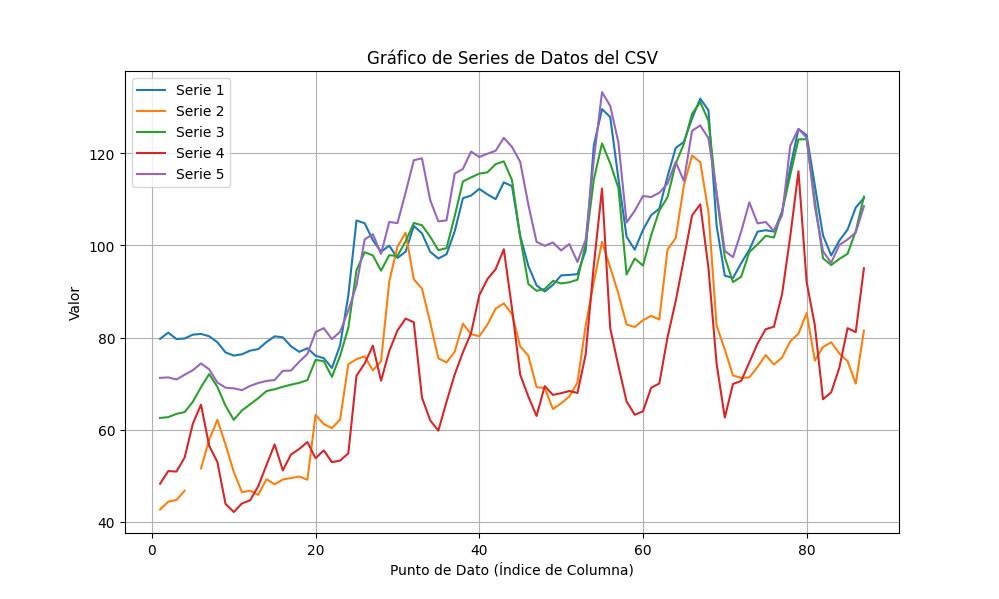

## Captura del curso con nuestro gráfico generado en V.S.C

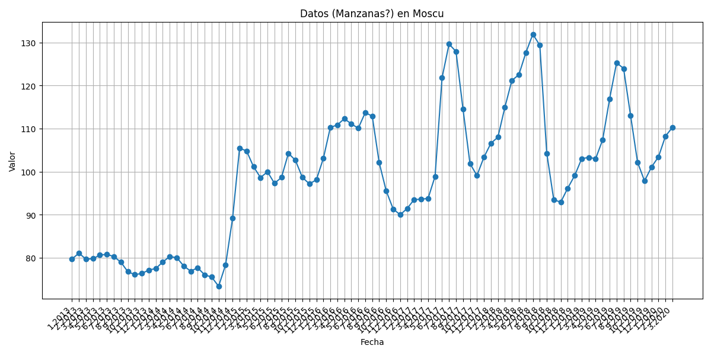

## Los siguientes Gráficos:

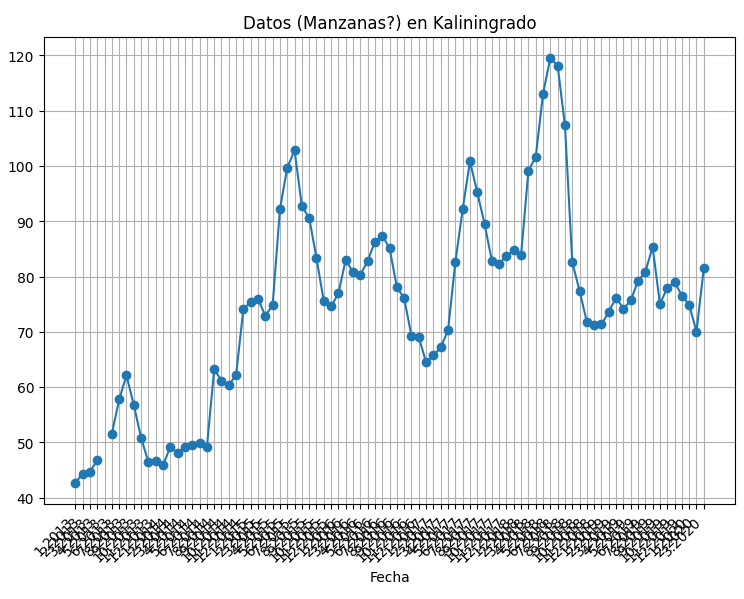

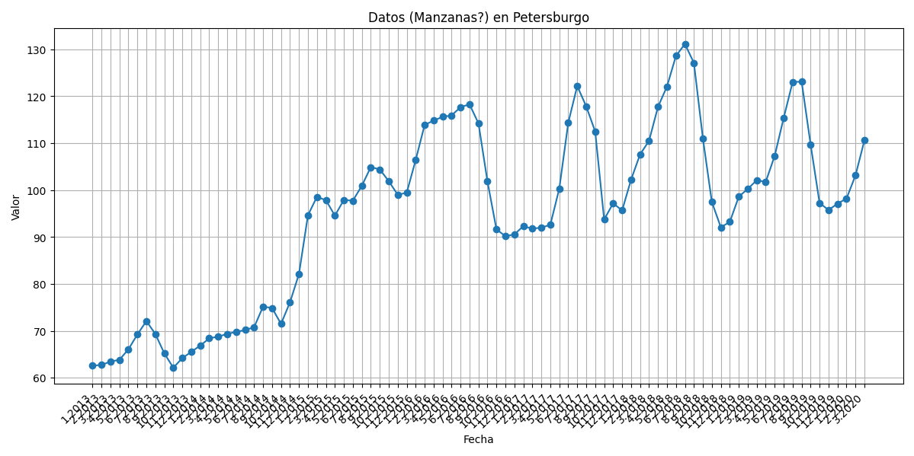

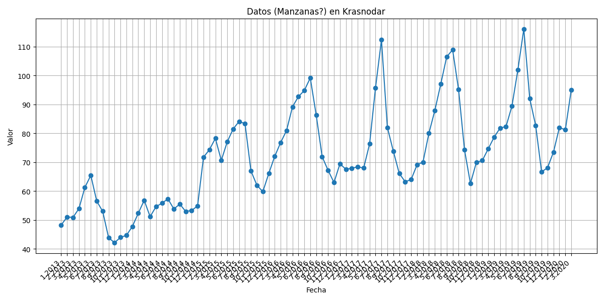

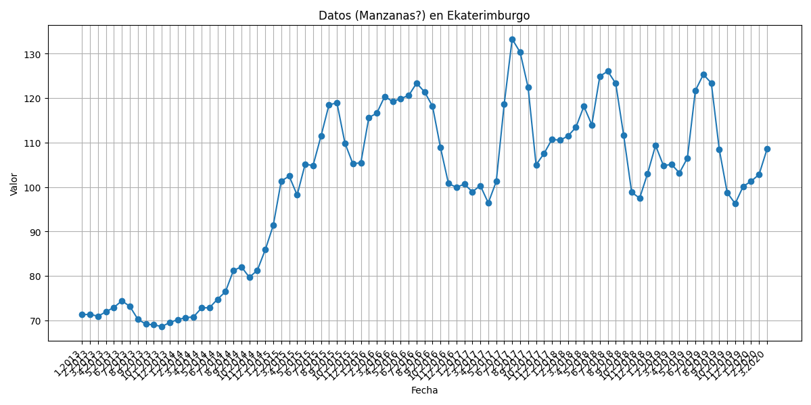

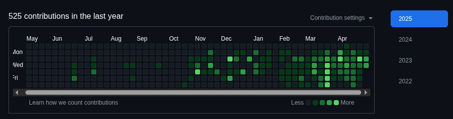

# 08/005/2025
09
Haga lo que hicimos
 Siguiente pregunta

Ha llegado el momento de poner a prueba los conocimientos adquiridos durante la lección. Continuando con el proyecto de las naranjas/toronjas, ahora debes seleccionar parte de los datos. Las columnas que evaluaremos son el diámetro y el peso. Crea arrays específicos para almacenar el diámetro y el peso de la naranja y la toronja. El diámetro está en la columna cero y el peso en la columna uno. Los datos de las naranjas van hasta la fila 4999 y los datos de las toronjas comienzan en la fila 5000 del archivo.

Después de seleccionar los datos, importa la biblioteca matplotlib y crea un gráfico para el peso en función del diámetro tanto para las naranjas como para las toronjas.

Ver opinión del instructor
Opinión del instructor

Para llevar a cabo esta etapa, puedes seguir los siguientes pasos:

Selección de datos:

diametro_naranja = dato[:5000, 0]
diametro_toronja = dato[5000:, 0]
peso_naranja = dato[:5000, 1]
peso_toronja = dato[5000:, 1]
Copia el código
Visualización:

import matplotlib.pyplot as plt

plt.plot(diametro_naranja, peso_naranja)
plt.plot(diametro_toronja, peso_toronja)

## wget https://gist.githubusercontent.com/ahcamachod/9be09de793dc3bf1e6c3d98eb4e5b1ef/raw/21b85572693200040e11284ef6dcfc3457ec8e11/citrus.csv

# app_2c.py
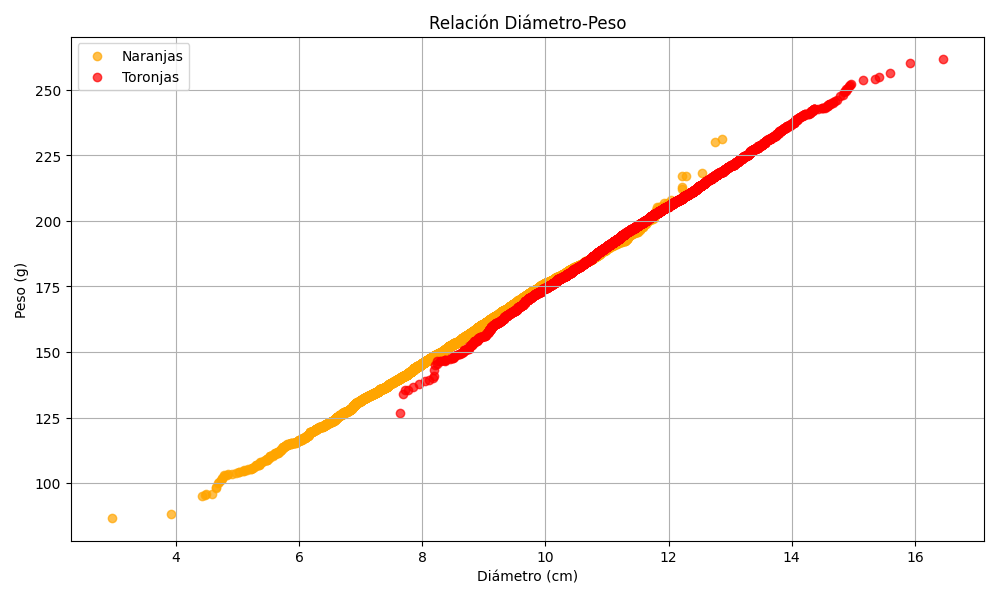

# app_2d.py
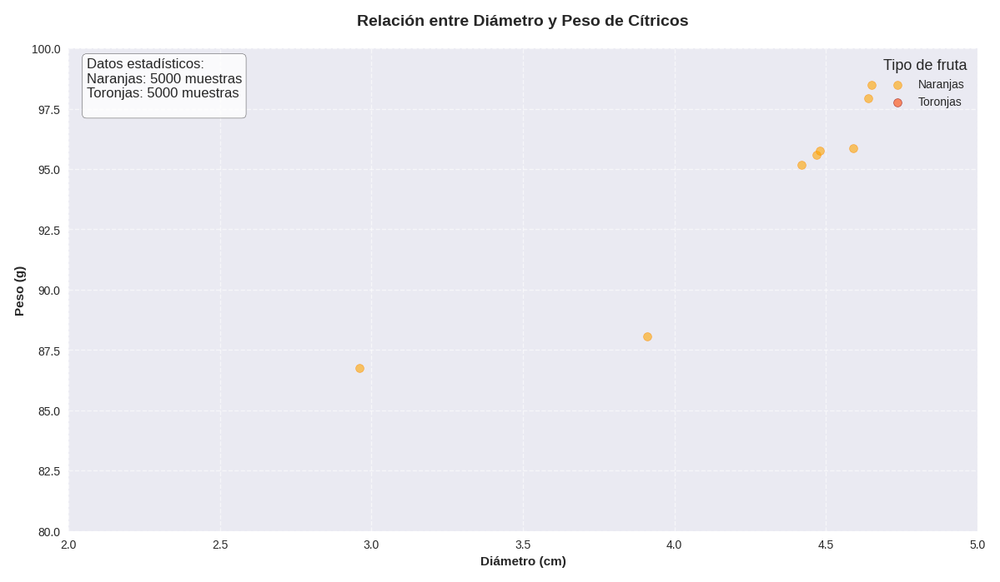

# app_2f.py
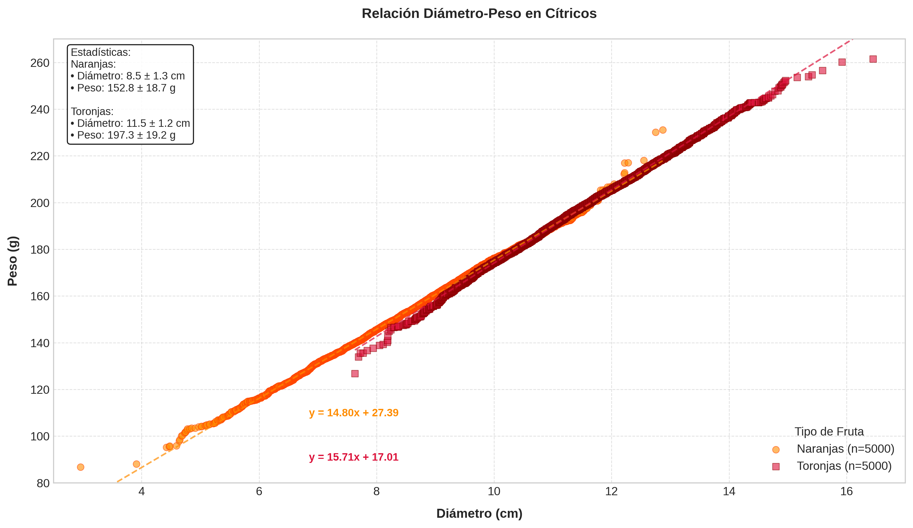

# app_2g.py
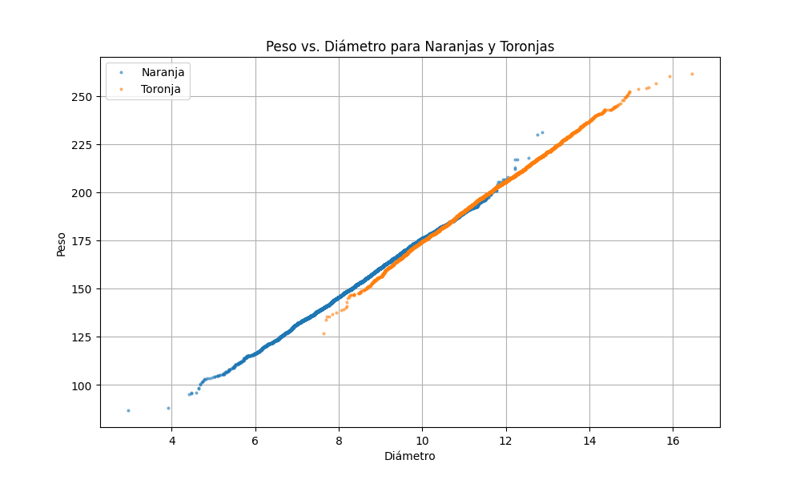

### El gráfico muestra claramente la relación entre el diámetro y el peso para las naranjas (puntos azules) y las toronjas (puntos naranjas).

## Puedes observar cómo los puntos de las naranjas se agrupan en un rango de diámetros y pesos más bajos, mientras que los puntos de las toronjas se agrupan en rangos más altos. Además, hay una clara tendencia lineal: a medida que el diámetro aumenta, el peso también lo hace para ambos tipos de fruta.

## Este gráfico visualiza de forma efectiva cómo estas dos características (diámetro y peso) permiten diferenciar entre naranjas y toronjas, lo cual es un paso fundamental en proyectos de clasificación de datos como este.