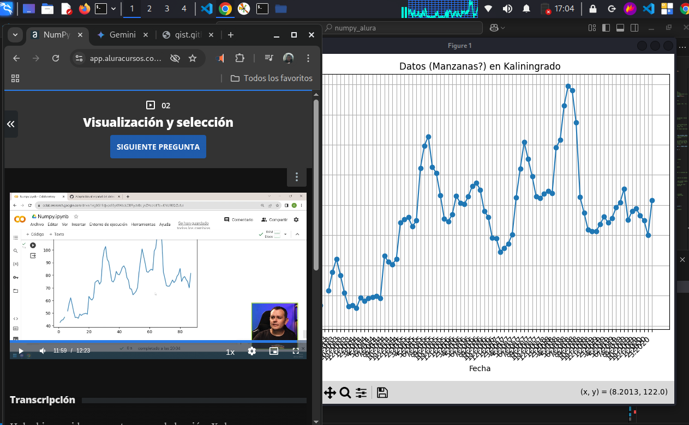
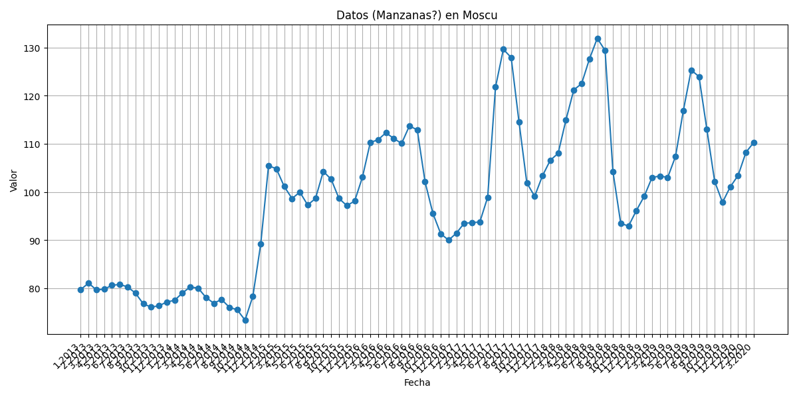

# numpy_alura
✅ 1. Lectura del archivo CSV con NumPy

data = np.genfromtxt('archivo.csv', delimiter=',')

¿Qué hace?

    np.genfromtxt es una función de NumPy para leer archivos de texto tipo CSV (valores separados por coma).

    delimiter=',' indica que los valores están separados por comas.

    El resultado es un arreglo NumPy (o "array") con los datos numéricos del archivo.

    Los valores faltantes ("" en el CSV) se interpretan como nan (Not a Number), lo cual es útil para análisis numérico.

✅ 2. Mostrar el contenido del CSV como arreglo NumPy

print("Contenido del archivo CSV:")
print(data)

¿Qué muestra?

Un arreglo bidimensional (2D array) con datos flotantes (float), donde cada fila probablemente representa una serie temporal (por ejemplo, precios a lo largo del tiempo), y algunas celdas están en blanco (por eso aparecen como nan).
✅ 3. Crear un arreglo con np.arange()

arreglo = np.arange(0, 10, 2)
print("Arreglo creado con np.arange(0, 10, 2):")
print(arreglo)

¿Qué hace?

    np.arange(inicio, fin, paso) crea un arreglo 1D con valores comenzando en inicio, hasta antes de fin, y con un paso fijo.

    En este caso: np.arange(0, 10, 2) genera [0, 2, 4, 6, 8].

📌 ¿Qué es un arreglo NumPy?

Es una estructura optimizada para cálculos numéricos, mucho más eficiente que las listas de Python. Podés:

    Realizar operaciones matemáticas vectorizadas (más rápidas).

    Aplicar funciones en todo el arreglo sin for.

    Manipular fácilmente datos multidimensionales (como matrices o imágenes).

¿Querés que agreguemos nuevas operaciones al código? Por ejemplo:

    Obtener el promedio por fila (ignorando nan).

    Visualizar los datos con matplotlib.

    Reemplazar nan por algún valor

## 📘 Explicación línea por línea:

| Línea                 | Qué hace                                          | Por qué es útil                       |
| --------------------- | ------------------------------------------------- | ------------------------------------- |
| `import numpy as np`  | Importa NumPy con el alias `np`                   | Para poder usar sus funciones         |
| `np.genfromtxt(...)`  | Carga un archivo `.csv` como matriz de NumPy      | Maneja bien valores faltantes (`NaN`) |
| `delimiter=','`       | Define que las columnas están separadas por comas | Necesario para `.csv`                 |
| `print(...)`          | Muestra en pantalla los datos y estructuras       | Para entender la forma de los datos   |
| `datos.shape`         | Muestra cuántas filas y columnas hay              | Importante para análisis              |
| `np.isnan(...).sum()` | Cuenta cuántos `NaN` hay                          | Detecta datos faltantes               |
| `np.arange(...)`      | Crea un arreglo de ejemplo                        | Ayuda a practicar                     |

## 07/05/2025

## Captura del curso con nuestro gráfico generado en V.S.C

## Los siguientes Gráficos:

